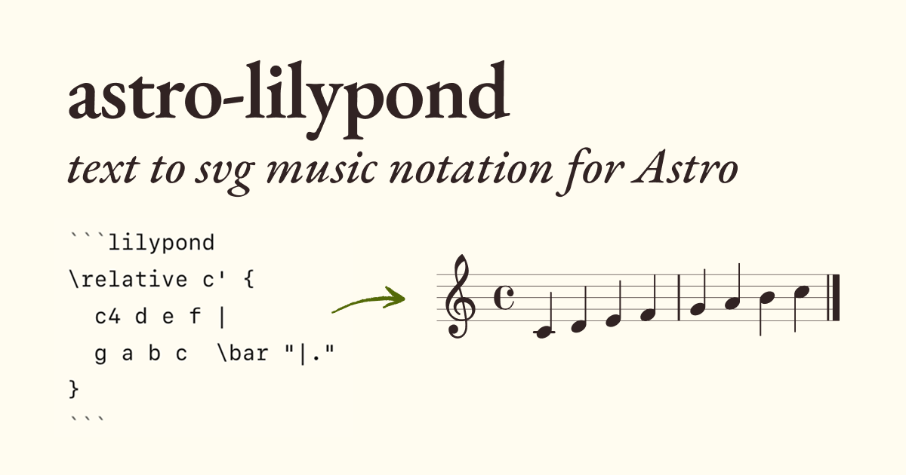

# astro-lilypond

An [Astro](https://astro.build) integration for rendering [LilyPond](https://lilypond.org) music notation to images.

- Render musical scores via Markdown or with an Astro component.
- Works with remark, rehype and satteri Markdown processors out-of-the-box.
- Zero client-side JavaScript! Images are compiled at build time.
- Automatic `alt` text generated from the score’s title and composer. (Or supply your own.)

Read the docs: https://lilypond.ky.fyi

## In this repo

| Directory | For |
| ----- | ------- |
| package | Contents of the published `astro-lilypond` package |
| docs | Starlight documentation site, deployed to https://lilypond.ky.fyi |
